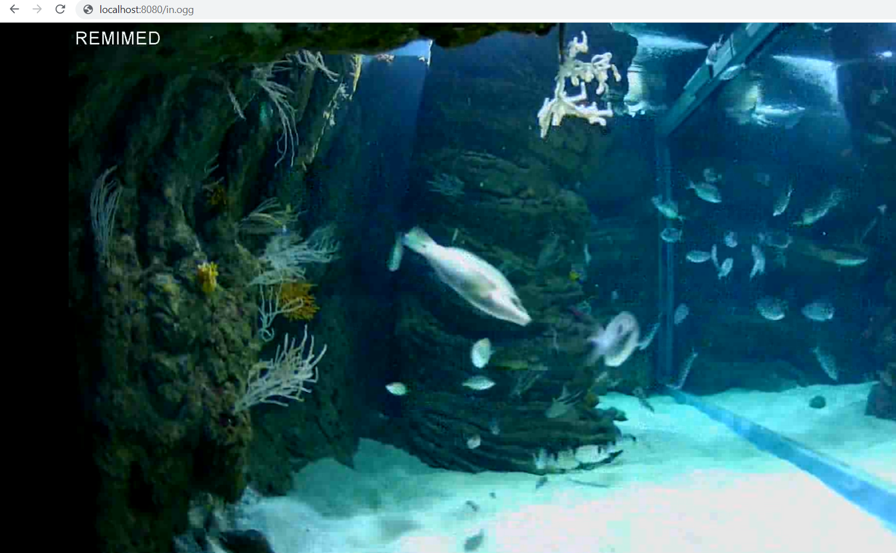
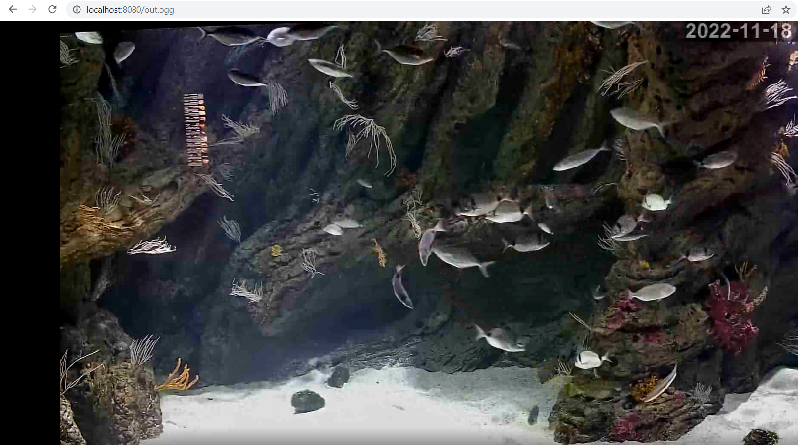
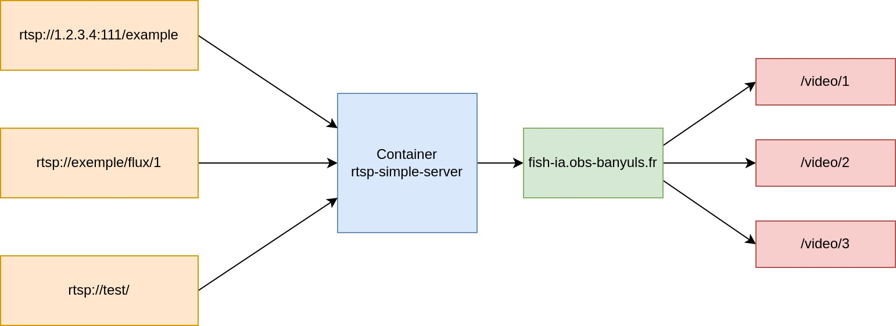

# Proxy video
**Auteur :** [Alexis DEVLEESCHAUWER](https://devleeschauwer.fr/)


## Description
[Container](https://hub.docker.com/r/aler9/rtsp-simple-server) qui permet de convertir les **flux video RTSP** et de le diffuser en flux video en **HLS**, **RTSP**, **RTMP** et **WEBRTC** .

## Configuration
Au travers du fichier rtsp-simple-server.yml la cles du paths "video/1" corespondra a l'addrese de sortie du flux "https://exemple.fr/video/1"

> [path video/test] [rtsp source] started
> [path video/1] [rtsp source] started
> [path video/2] [rtsp source] started
> [RTSP] listener opened on :8554 (TCP), :8000 (UDP/RTP), :8001 (UDP/RTCP)
> [RTMP] listener opened on :1935
> [HLS] listener opened on :8888
> [WebRTC] listener opened on :8889 (HTTP)

Il est donc possible de configguere auttant de point d'entrée que voulue avec une seule sortie sur un seule port
```yml
paths:
    video/1:
    source: rtsp://example.org/flux
```
### Schema

